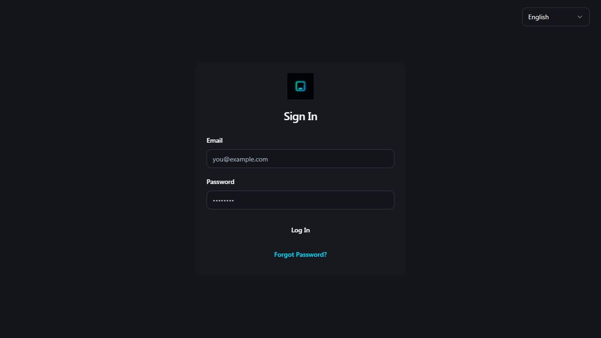
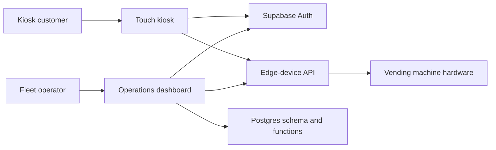

# NextGen Vending Platform

A two-surface vending platform: an operations dashboard for fleet management and a touch-oriented kiosk for customer checkout. This portfolio edition preserves the application architecture and database migrations while removing deployment identifiers, credentials, build artifacts, and repository history.



[Watch the 75-second demo](docs/demo.mp4)

## What it demonstrates

- A React + TypeScript operations console for machines, inventory, notifications, settings, and live status
- A separate kiosk experience with authentication, machine pairing, product browsing, cart state, and maintenance/error flows
- Shared integration patterns for Supabase Auth and a configurable edge-device API
- Database evolution captured as versioned SQL migrations and a scheduled offline-machine detector
- Explicit runtime configuration with no backend URLs or keys committed to source

## Architecture



The dashboard and kiosk are intentionally separate applications so their navigation, deployment cadence, and device constraints can evolve independently. Both apps obtain service locations and public client configuration from environment variables.

## Repository map

```text
apps/
  dashboard/  Fleet operations UI, SQL migrations, and serverless function
  kiosk/      Customer-facing kiosk UI and edge-device integration
```

## Local setup

Requirements: Node.js 20+ and npm.

1. Copy `.env.example` to `.env.local` inside each app.
2. Add configuration for a development Supabase project. Never commit the resulting files.
3. Install and build each application:

```sh
npm ci --prefix apps/dashboard
npm ci --prefix apps/kiosk
npm run build
```

Start either development server with `npm run dev:dashboard` or `npm run dev:kiosk`.

## Verification

```sh
npm run lint
npm test
npm run build
```

CI runs kiosk domain tests plus lint and production builds for both applications. The regression suite covers inventory transitions, oversell prevention, offline-sale recovery, authorization routing, and kiosk state transitions. Backend services and vending hardware are not bundled, so interactive authentication and device actions require your own development environment.

## Portfolio privacy boundary

This clone contains no production credentials, deployment identifiers, customer records, local databases, generated bundles, or prior Git history. The committed SQL files describe schema design only. Runtime secrets belong in ignored environment files.

## Status

Portfolio case study and buildable source snapshot. It is not presented as a hosted production service, and no license is granted by default.

Use the synthetic 75-second walkthrough in [`docs/demo-script.md`](docs/demo-script.md) for a reviewer-safe demonstration without real machines, customer accounts, or production credentials.
